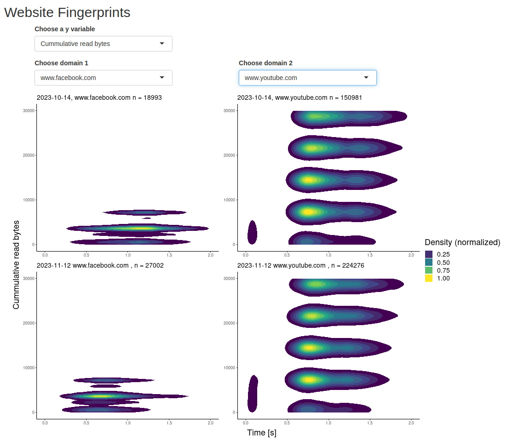

# Website Fingerprint Visualization

Shiny app for visualizing website fingerprints as 2D density plots.

The visualized data is extracted from OONI (Open Observatory of Network Interference) open data, measured by the Webconnectivity network experiment. Explore [OONI open data here](https://explorer.ooni.org/).

## Requirements
* R (≥ 3.3.0)
* ggplot2 (≥ 3.4.0)
* shiny
* ggpubr

## Run it
Open the project file `shiny_app.Rproj` in RStudio, install the required packages if not already, and *Run* the application.